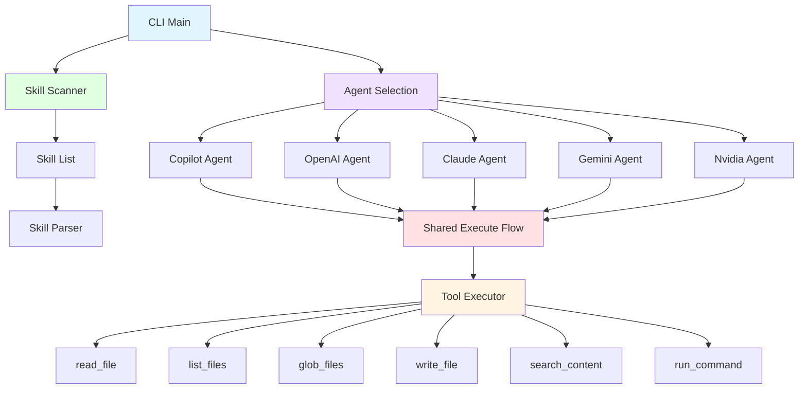

> [!NOTE]
> This README was generated by [SKILL](https://github.com/pardnchiu/skill-readme-generate), get the ZH version from [here](./README.zh.md).

# go-agent-skills

[](https://pkg.go.dev/github.com/pardnchiu/go-agent-skills)
[](https://goreportcard.com/report/github.com/pardnchiu/go-agent-skills)
[](LICENSE)
[](https://github.com/pardnchiu/go-agent-skills/releases)

> A lightweight Go CLI tool that executes AI skills via multiple agent backends with a complete filesystem toolchain

## Table of Contents

- [Features](#features)
- [Architecture](#architecture)
- [Installation](#installation)
- [Usage](#usage)
- [CLI Reference](#cli-reference)
- [API Reference](#api-reference)
- [License](#license)
- [Author](#author)
- [Stars](#stars)

## Features

- **Multi-Agent Backend Support**: Supports GitHub Copilot, OpenAI, Claude, Gemini, and Nvidia as AI agent backends with interactive selection menu
- **GitHub Copilot Authentication**: Device code login flow with automatic token refresh mechanism
- **API Key Authentication**: OpenAI, Claude, Gemini, and Nvidia authenticate directly via environment variable API keys
- **Multi-Directory Skill Scanning**: Automatically scans `.claude/skills`, `.skills`, `.opencode/skills`, `.openai/skills`, `.codex/skills`, and `/mnt/skills/*` for available skills
- **Skill Execution Engine**: Unified Agent interface with up to 128 tool call iterations
- **Complete Tool System**: Built-in `read_file`, `list_files`, `glob_files`, `write_file`, `search_content`, and `run_command` tools
- **Safe Command Execution**: Command whitelist mechanism, `rm` automatically moves to `.Trash` instead of deleting
- **Interactive Confirmation**: Prompts user before each tool call, supports `--allow` flag to skip confirmation

## Architecture



## Installation

### Prerequisites

- Go 1.20 or higher
- At least one AI agent credential (GitHub Copilot subscription or API key)

### Install from Source

```bash
git clone https://github.com/pardnchiu/go-agent-skills.git
cd go-agent-skills
go build -o agent-skills cmd/cli/main.go
```

### Using go install

```bash
go install github.com/pardnchiu/go-agent-skills/cmd/cli@latest
```

### Environment Variables Setup

Copy `.env.example` and fill in the corresponding API keys:

```bash
cp .env.example .env
```

```env
OPENAI_API_KEY=
ANTHROPIC_API_KEY=
GEMINI_API_KEY=
NVIDIA_API_KEY=
```

## Usage

### List All Available Skills

```bash
./agent-skills list
```

Example output:

```
Found 3 skill(s):

• commit-generate
  Generate single-sentence commit message from git diff
  Path: /Users/user/.claude/skills/commit-generate

• readme-generate
  Generate bilingual README from source code analysis
  Path: /Users/user/.claude/skills/readme-generate

• version-generate
  Generate structured changelog and recommend new version from latest git tag to HEAD
  Path: /Users/user/.claude/skills/version-generate
```

### Execute a Skill

```bash
./agent-skills run <skill_name> <input>
```

An agent selection menu appears after execution:

```
? Select Agent:
  > GitHub Copilot
    OpenAI
    Claude
    Gemini
    Nvidia
```

Example:

```bash
# Interactive mode (confirm before each tool call)
./agent-skills run commit-generate "generate commit message from current changes"

# Auto mode (skip confirmation)
./agent-skills run readme-generate "generate readme" --allow
```

### GitHub Copilot First-Time Authentication

When selecting GitHub Copilot without a stored token, the device code login flow triggers automatically. The token is stored at `~/.config/go-agent-skills/copilot_token.json`.

## CLI Reference

| Command | Syntax | Description |
|---------|--------|-------------|
| `list` | `./agent-skills list` | List all installed skills |
| `run` | `./agent-skills run <skill> <input> [--allow]` | Execute the specified skill |

### Flags

| Flag | Description |
|------|-------------|
| `--allow` | Skip interactive confirmation prompts for tool calls |

### Supported Agents

| Agent | Authentication | Default Model | Environment Variable |
|-------|---------------|---------------|---------------------|
| GitHub Copilot | Device code login | `gpt-4.1` | - |
| OpenAI | API Key | `gpt-5-nano` | `OPENAI_API_KEY` |
| Claude | API Key | `claude-sonnet-4-5` | `ANTHROPIC_API_KEY` |
| Gemini | API Key | `gemini-2.5-pro` | `GEMINI_API_KEY` |
| Nvidia | API Key | `openai/gpt-oss-120b` | `NVIDIA_API_KEY` |

### Built-in Tools

| Tool | Parameters | Description |
|------|------------|-------------|
| `read_file` | `path` | Read file content at the specified path |
| `list_files` | `path`, `recursive` | List directory contents with optional recursive mode |
| `glob_files` | `pattern` | Find files matching a glob pattern (e.g., `**/*.go`) |
| `write_file` | `path`, `content` | Write or create a file |
| `search_content` | `pattern`, `file_pattern` | Search file content using regex patterns |
| `run_command` | `command` | Execute whitelisted shell commands |

### Allowed Commands

| Category | Commands |
|----------|----------|
| Version Control | `git` |
| Languages & Package Managers | `go`, `node`, `npm`, `yarn`, `pnpm`, `python`, `python3`, `pip`, `pip3` |
| File Operations | `ls`, `cat`, `head`, `tail`, `pwd`, `mkdir`, `touch`, `cp`, `mv`, `rm`* |
| Text Processing | `grep`, `sed`, `awk`, `sort`, `uniq`, `diff`, `cut`, `tr`, `wc` |
| Search | `find` |
| Data Format | `jq` |
| System Info | `echo`, `which`, `date` |

> \* The `rm` command automatically moves files to a `.Trash` directory instead of permanently deleting them

## API Reference

### Agent Interface (`internal/agents`)

```go
type Agent interface {
    Send(ctx context.Context, messages []Message, toolDefs []tools.Tool) (*OpenAIOutput, error)
    Execute(ctx context.Context, skill *skill.Skill, userInput string, output io.Writer, allowAll bool) error
}
```

All agents implement this unified interface. `Execute` is the high-level method handling the complete skill execution loop, while `Send` is the low-level method responsible for a single API call.

### Shared Execution Flow

```go
func Execute(ctx context.Context, agent Agent, workDir string, skill *skill.Skill, userInput string, output io.Writer, allowAll bool) error
```

Unified skill execution engine iterating up to 128 tool call rounds. Each iteration parses tool call requests from the API response, executes the corresponding tools, and feeds results back to the agent.

### Skill Scanner (`internal/skill`)

```go
func NewScanner() *Scanner
```

Create a skill scanner and immediately perform concurrent scanning across all configured paths using goroutines.

### Tool Executor (`internal/tools`)

```go
func NewExecutor(workPath string) (*Executor, error)
```

Create a tool executor that loads tool definitions from embedded `tools.json` and initializes the command whitelist and directory exclusion list.

### HTTP Utilities (`internal/utils`)

Provides generic HTTP methods (`GET`, `POSTForm`, `POSTJson`) with automatic response deserialization using Go generics.

## License

This project is licensed under the [MIT LICENSE](LICENSE).

## Author


<h4 style="padding-top: 0">邱敬幃 Pardn Chiu</h4>

<a href="mailto:dev@pardn.io" target="_blank">

</a> <a href="https://linkedin.com/in/pardnchiu" target="_blank">

</a>

## Stars

[](https://www.star-history.com/#pardnchiu/go-agent-skills&Date)

***

©️ 2026 [邱敬幃 Pardn Chiu](https://linkedin.com/in/pardnchiu)
