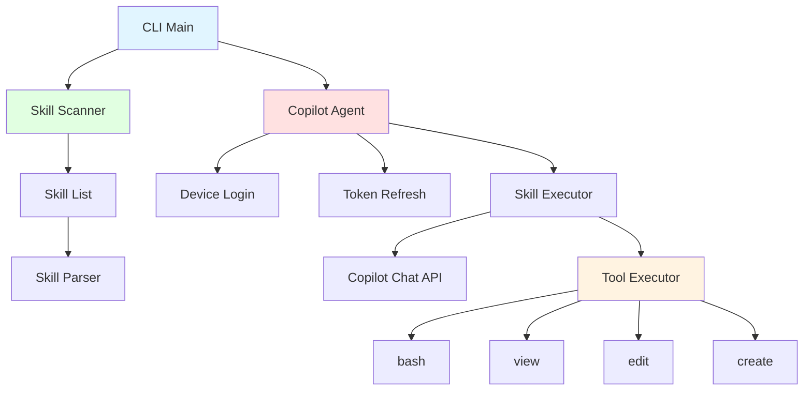

> [!NOTE]
> This README was generated by [SKILL](https://github.com/pardnchiu/skill-readme-generate), get the ZH version from [here](./README.zh.md).

# go-agent-skills

[](https://pkg.go.dev/github.com/pardnchiu/go-agent-skills)
[](https://goreportcard.com/report/github.com/pardnchiu/go-agent-skills)
[](LICENSE)
[](https://github.com/pardnchiu/go-agent-skills/releases)

> A lightweight Go CLI tool for executing skills with GitHub Copilot authentication integration

## Table of Contents

- [Features](#features)
- [Architecture](#architecture)
- [Installation](#installation)
- [Usage](#usage)
- [CLI Reference](#cli-reference)
- [API Reference](#api-reference)
- [License](#license)
- [Author](#author)
- [Stars](#stars)

## Features

- **GitHub Copilot Authentication**: Supports device code login flow and automatic token refresh mechanism
- **Skill Scanning**: Automatically scans all available skills in the `.claude/skills` directory
- **Skill Execution**: Executes skills via Copilot Chat API and handles tool invocation loops
- **Tool Executor**: Built-in tool execution system with comprehensive tool support
- **Token Management**: Automatically handles token expiration and renewal to maintain authentication state
- **Command-Line Interface**: Provides `list` and `run` commands to manage and execute skills

### Roadmap

**Authentication:**
- [x] Support GitHub Copilot authentication
- [ ] Support Claude API key authentication
- [ ] Support Claude device authentication
- [ ] Support OpenAI API key authentication
- [ ] Support OpenAI device authentication

**Skill Management:**
- [x] Support list/run skills from multiple directories (`.claude/skills`, `.skills`, `.opencode/skills`, `.openai/skills`, `.codex/skills`, `/mnt/skills/*`)

**Tool Implementation:**
- [x] Implement `read_file(path)` - Read file content
- [ ] Implement `list_files(path, recursive)` - List directory contents
- [ ] Implement `glob_files(pattern)` - Find files by pattern
- [ ] Implement `search_content(pattern, file_pattern)` - Search text in files
- [ ] Implement `write_file(path, content)` - Write/create files
- [ ] Implement `run_command(command)` - Execute shell commands (git, go, npm, python3, etc.)

## Architecture



## Installation

### Prerequisites

- Go 1.20 or higher
- GitHub Copilot subscription (for authentication)

### Install from Source

```bash
git clone https://github.com/pardnchiu/go-agent-skills.git
cd go-agent-skills
go build -o agent-skills cmd/cli/main.go
```

### Using go install

```bash
go install github.com/pardnchiu/go-agent-skills/cmd/cli@latest
```

## Usage

### First-Time Authentication

On first run, the GitHub Copilot device code login flow will be triggered automatically:

```bash
./agent-skills
```

The system will display:
1. User Code
2. Verification URI

Open the verification URI in your browser and enter the user code to complete authentication.

### List All Available Skills

```bash
./agent-skills list
```

Example output:

```
Found 3 skill(s):

• readme-generate
  Generate bilingual README from source code analysis
  Path: /Users/user/.claude/skills/readme-generate

• version-generate
  Generate structured changelog and recommend new version from latest git tag to HEAD
  Path: /Users/user/.claude/skills/version-generate

• commit-generate
  Generate single-sentence commit message from git diff
  Path: /Users/user/.claude/skills/commit-generate
```

### Execute a Skill

```bash
./agent-skills run <skill_name> <input>
```

Example:

```bash
./agent-skills run commit-generate "generate commit message from current changes"
```

## CLI Reference

| Command | Syntax | Description |
|---------|--------|-------------|
| `list` | `./agent-skills list` | List all installed skills |
| `run` | `./agent-skills run <skill> <input>` | Execute the specified skill |

### Environment Variables

| Variable | Default | Description |
|----------|---------|-------------|
| `HOME` | - | Used to locate token storage path `~/.copilot/` |

## API Reference

### Client Package (`internal/client`)

#### `NewCopilot() (*CopilotAgent, error)`

Creates a new Copilot client instance, automatically loads or creates token.

**Returns:**
- `*CopilotAgent`: Copilot client instance
- `error`: Error message if any

#### `(*CopilotAgent) Execute(ctx context.Context, skill *skill.Skill, userInput string, output io.Writer) error`

Executes the specified skill.

**Parameters:**
- `ctx`: Context instance
- `skill`: Skill instance to execute
- `userInput`: User input command or prompt
- `output`: Output writer (typically `os.Stdout`)

**Returns:**
- `error`: Error during execution if any

#### `CopilotLogin(ctx context.Context, tokenPath string) (*CopilotToken, error)`

Performs device code login flow.

**Parameters:**
- `ctx`: Context instance
- `tokenPath`: Token storage path

**Returns:**
- `*CopilotToken`: Authentication token
- `error`: Error message if any

### Skill Package (`internal/skill`)

#### `NewScanner() *Scanner`

Creates a new skill scanner instance.

**Returns:**
- `*Scanner`: Scanner instance

#### `(*Scanner) Scan() (*SkillList, error)`

Scans all available skills.

**Returns:**
- `*SkillList`: Contains all scanned skills
- `error`: Error message if any

#### `(*SkillList) List() []string`

Gets a list of all skill names.

**Returns:**
- `[]string`: Array of skill names

### Tools Package (`internal/tools`)

#### `NewExecutor(workPath string) (*Executor, error)`

Creates a new tool executor.

**Parameters:**
- `workPath`: Working directory path

**Returns:**
- `*Executor`: Tool executor instance
- `error`: Error message if any

#### `(*Executor) Execute(name string, args json.RawMessage) (string, error)`

Executes the specified tool.

**Parameters:**
- `name`: Tool name (e.g., `bash`, `view`, `edit`, `create`)
- `args`: Tool parameters in JSON format

**Returns:**
- `string`: Tool execution result
- `error`: Error message if any

### Data Structures

#### `CopilotToken`

```go
type CopilotToken struct {
    AccessToken string    `json:"access_token"`
    TokenType   string    `json:"token_type"`
    Scope       string    `json:"scope"`
    ExpiresAt   time.Time `json:"expires_at"`
}
```

#### `Skill`

```go
type Skill struct {
    Name        string // Skill name
    Description string // Skill description
    AbsPath     string // Absolute path
    Path        string // Relative path
    Content     string // Full file content
    Body        string // Skill body content
    Hash        string // Content hash
}
```

#### `SkillList`

```go
type SkillList struct {
    ByName map[string]*Skill // Skills indexed by name
    ByPath map[string]*Skill // Skills indexed by path
    Paths  []string          // List of scanned paths
}
```

#### `Tool`

```go
type Tool struct {
    Type     string       `json:"type"`
    Function ToolFunction `json:"function"`
}

type ToolFunction struct {
    Name        string          `json:"name"`
    Description string          `json:"description"`
    Parameters  json.RawMessage `json:"parameters"`
}
```

## License

This project is licensed under the [MIT LICENSE](LICENSE).

## Author


<h4 style="padding-top: 0">邱敬幃 Pardn Chiu</h4>

<a href="mailto:dev@pardn.io" target="_blank">

</a> <a href="https://linkedin.com/in/pardnchiu" target="_blank">

</a>

## Stars

[](https://www.star-history.com/#pardnchiu/go-agent-skills&Date)

***

©️ 2026 [邱敬幃 Pardn Chiu](https://linkedin.com/in/pardnchiu)
