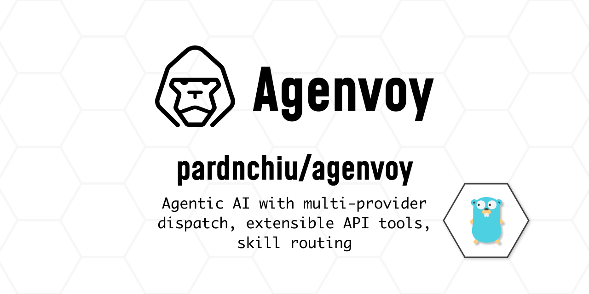
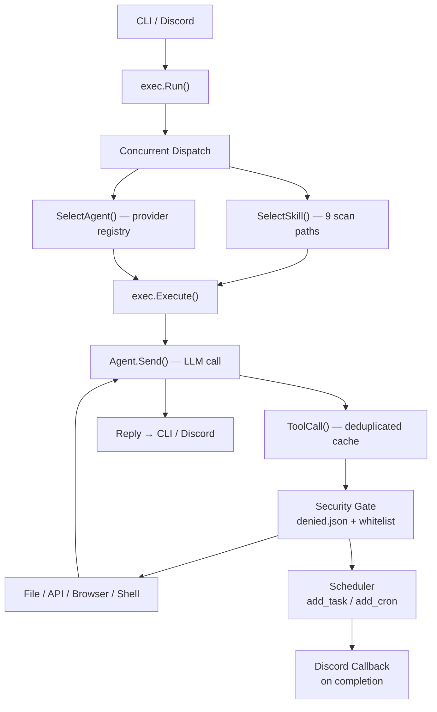

> [!NOTE]
> This README was generated by [SKILL](https://github.com/pardnchiu/skill-readme-generate), get the ZH version from [here](./doc/README.zh.md).<br>
> Tests are generated by [SKILL](https://github.com/pardnchiu/skill-coverage-generate).



# Agenvoy

[](https://pkg.go.dev/github.com/pardnchiu/agenvoy)
[](https://goreportcard.com/report/github.com/pardnchiu/agenvoy)
[](https://app.codecov.io/github/pardnchiu/agenvoy/tree/master)
[](LICENSE)
[](https://github.com/pardnchiu/agenvoy/releases)

> A Go agentic AI platform with multi-provider intelligent routing, skill-based execution, persistent task scheduling, extensible JSON-driven tools, and security-first credential management

## Table of Contents

- [Features](#features)
- [Architecture](#architecture)
- [File Structure](#file-structure)
- [Version History](#version-history)
- [License](#license)
- [Author](#author)
- [Stars](#stars)

## Features

> `go install github.com/pardnchiu/agenvoy/cmd/cli@latest` · [Documentation](./doc/doc.md)

### Multi-Provider LLM with Intelligent Routing

Agenvoy integrates seven AI backends — GitHub Copilot, Claude, OpenAI, Gemini, Nvidia NIM, and any OpenAI-compatible endpoint (Compat/Ollama) — behind a unified `Agent` interface. A dedicated planner LLM automatically selects the most appropriate provider for each request, eliminating the need to manually switch models. Named `compat[{name}]` instances allow multiple local model endpoints to coexist, each with independent URL and credential configuration.

### Skill-Based Agentic Execution

Skills are declarative Markdown files (`SKILL.md`) that define a task's system prompt and tool allowlist. At runtime, a Selector LLM picks the best matching skill across 9 standard scan paths, then drives a tool-call loop of up to 128 iterations until the task completes. When the iteration limit is reached, the engine automatically triggers summarization rather than returning an error. Skill extensions are auto-synced from GitHub on startup via `SyncSkills`.

### 25+ Built-in Tools Across Six Categories

The executor ships a comprehensive toolchain: filesystem operations (`read_file`, `write_file`, `patch_edit`, `glob_files`, `search_content`), web access (`search_web`, `fetch_page`, `download_page`, `fetch_google_rss`), scheduling (`add_task`, `add_cron`, `write_script`), error memory (`remember_error`, `search_errors`, `get_tool_error`), a math calculator, and arbitrary HTTP requests. Every `rm` is redirected to `.Trash` and all writes use atomic tmp-then-rename to prevent partial file corruption.

### JSON-Driven API Extension Architecture

External REST APIs are defined as JSON files under `extensions/apis/` and loaded at runtime through the API adapter — no Go code required. Thirteen public-domain APIs are bundled out of the box: Yahoo Finance, CoinGecko, Wikipedia, World Bank, USGS Earthquake, Nominatim, Open-Meteo, HackerNews, REST Countries, TheMealDB, IP-API, and exchange rates. Custom endpoints follow the same schema, making the tool surface arbitrarily extensible without recompilation.

### Discord Bot Mode with Task Scheduler

`cmd/server` launches a persistent Discord bot handling both direct messages and slash commands with per-channel session state. The integrated scheduler supports one-time tasks (via `+5m` or absolute timestamps) and recurring cron jobs (standard 5-field expressions validated by `go-scheduler`). Each task is linked to a Discord channel ID: when a script completes, the planner agent processes stdout and posts results back to the originating channel. The `schedule-task` skill routes natural-language timing intent to the scheduler automatically.

### Cross-Session Persistent Memory

At the end of each turn, the agent emits a structured JSON summary that is deep-merged with the previous session summary using field-level deduplication, then stored in `~/.config/agenvoy/`. Subsequent sessions inject this summary alongside the last N conversation turns, allowing the agent to recall decisions, constraints, and conclusions without replaying full history. Tool-execution errors are persisted with SHA-256 keys so the agent can look up past root causes before retrying.

### OS Keychain Credential Management

API keys are stored in the OS-native keychain (macOS Keychain, Linux Secret Service) rather than plain environment variables. GitHub Copilot uses OAuth Device Code Flow with automatic token refresh. The interactive `agenvoy add` / `agenvoy remove` commands manage credentials across all six providers with an embedded model registry for guided selection. A multi-layer path deny-list blocks access to SSH keys, shell configs, cloud credentials (`.aws`, `.gcloud`, `.docker`), `.env` files, and private key formats across all file and command tools.

## Architecture


```mermaid
graph TB
    Input["CLI / Discord"] --> Run["exec.Run()"]
    Run --> Concurrent["Concurrent Dispatch"]
    Concurrent --> SkillSelect["SelectSkill() — 9 scan paths"]
    Concurrent --> AgentSelect["SelectAgent() — provider registry"]
    SkillSelect --> Execute["exec.Execute()"]
    AgentSelect --> Execute
    Execute --> Send["Agent.Send() — LLM call"]
    Send --> ToolCall["ToolCall() — deduplicated cache"]
    ToolCall --> Security["Security Gate\ndenied.json + whitelist"]
    Security --> Tools["File / API / Browser / Shell"]
    Security --> Scheduler["Scheduler\nadd_task / add_cron"]
    Tools --> Send
    Scheduler --> Callback["Discord Callback\non completion"]
    Send --> Output["Reply → CLI / Discord"]
```

## File Structure

```
agenvoy/
├── cmd/
│   ├── cli/                # CLI: add / remove / list / run
│   └── server/             # Discord bot entry point
├── configs/                # Embedded prompts and provider JSON registry
├── extensions/
│   ├── apis/               # Embedded API extensions (13+ JSON)
│   └── skills/             # Embedded skill extensions (Markdown)
├── internal/
│   ├── agents/
│   │   ├── exec/           # Core execution engine and session loop
│   │   ├── provider/       # 6 AI provider backends + model registry
│   │   └── types/          # Agent interface + message types
│   ├── discord/            # Discord slash commands + file attachments
│   ├── filesystem/         # Centralized path constants and session manager
│   ├── scheduler/          # Persistent one-time and recurring task scheduler
│   ├── skill/              # Markdown skill scanner and parser
│   ├── tools/              # 25+ built-in tools + API extension adapter
│   └── keychain/           # OS keychain credential storage
├── go.mod
└── LICENSE
```

## Version History

- **v0.12.0** — Full scheduler subsystem (cron + one-time tasks with Discord callbacks); centralize `filesystem` + `configs` packages; replace custom cron parser with `go-scheduler`; `schedule-task` skill
- **v0.11.2** — Fix bidirectional error-memory keyword matching; fix Claude multi-system-prompt merge; pre-tool text suppression rule in system prompt
- **v0.11.1** — Tool execution error tracking (hash-based `tool_errors/`); atomic writes (`utils.WriteFile`); Gemini multipart message fix; 8 new public API extensions; `get_tool_error` tool
- **v0.11.0** — Declarative Extension architecture — built-in Go API tools migrated to JSON extensions; `SyncSkills` from GitHub; switch license to **Apache-2.0**
- **v0.10.2** — Fix `temperature` for OpenAI reasoning models (`gpt-5`, `gpt-4.1`); `no_temperature` model flag; `planner` CLI command; `makefile`
- **v0.10.1** — Provider model registry with embedded JSON configs; interactive model selection UI; uniform `temperature=0.2` across all providers
- **v0.10.0** — Discord bot mode with full slash command support; `download_page` browser tool; multi-layer sensitive path security (`denied.json`); HTML-to-Markdown converter
- **v0.9.0** — File injection (`--file`), image input (`--image`); `remember_error` / `search_errors` tools; web search SHA-256 cache (1-hour TTL); `remove` command; public API (`GetSession`, `SelectAgent`, `SelectSkill`)
- **v0.8.0** — Rename to **Agenvoy** (AGPL-3.0); OS Keychain integration for secure API key storage; named `compat[{name}]` instances; GitHub Actions CI + unit tests
- **v0.7.2** — Split CLI entry into focused modules; `mergeSummary` deep-merge strategy; API example configs (exchange-rate, ip-api)
- **v0.7.1** — Fix race conditions across all providers (instance-level `model` field); fix Context chain in `runCommand` / `moveToTrash`; replace `strconv.Unquote` with `json.Unmarshal` for Unicode handling
- **v0.7.0** — LLM-driven automatic agent routing; OpenAI-compatible (`compat`) provider / Ollama support; `search_history` tool; file-locking for concurrent sessions; split monolithic `exec.go` into sub-package
- **v0.6.0** — Summary-based persistent memory; session history (`history.json`); tool action logging; centralized `utils.ConfigDir()`
- **v0.5.0** — Add `fetch_page` (headless Chrome + stealth JS), `search_web` (Brave + DDG concurrent), `calculate`; Context propagation through the full tool chain
- **v0.4.0** — Built-in API tools (weather, stock, news, HTTP); JSON-driven API adapter; `patch_edit` tool; skill auto-matching engine; `io.Writer` → Event Channel output model
- **v0.3.0** — Multi-agent backend support: OpenAI, Claude, Gemini, Nvidia; unified `Agent` interface; concurrent goroutine skill scanner
- **v0.2.0** — Add full filesystem toolchain (`list_files`, `glob_files`, `write_file`, `search_content`, `run_command`), command whitelist, interactive confirmation, `--allow` flag
- **v0.1.0** — Initial release — GitHub Copilot CLI with skill execution loop and automatic token refresh

## License

This project is licensed under the [Apache-2.0 LICENSE](LICENSE).

## Author


<h4 style="padding-top: 0">邱敬幃 Pardn Chiu</h4>

<a href="mailto:dev@pardn.io" target="_blank">

</a> <a href="https://linkedin.com/in/pardnchiu" target="_blank">

</a>

## Stars

[](https://www.star-history.com/#pardnchiu/agenvoy&Date)

***

©️ 2026 [邱敬幃 Pardn Chiu](https://linkedin.com/in/pardnchiu)
