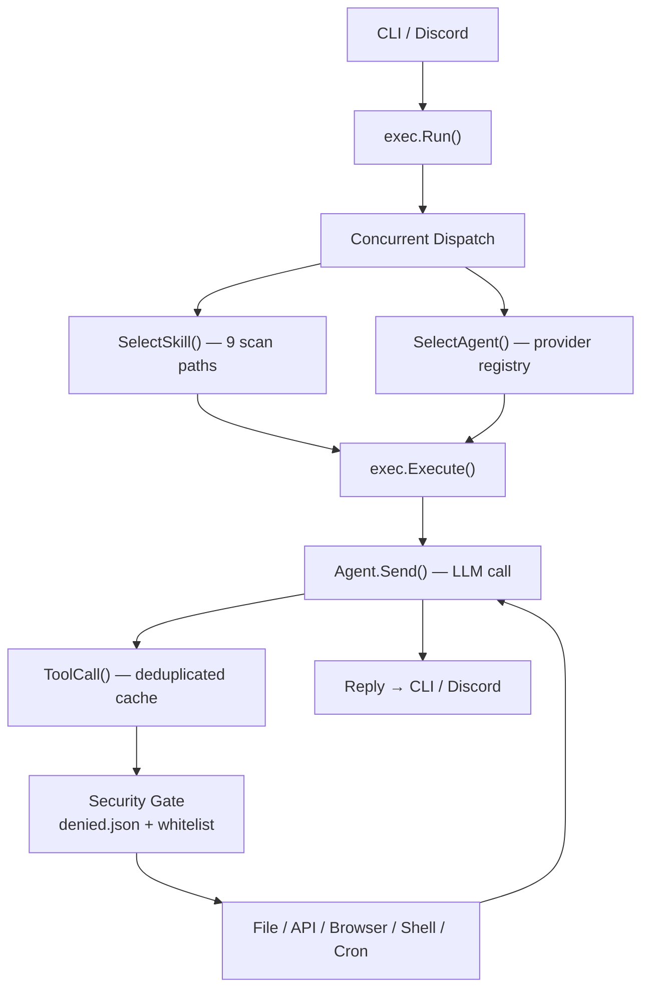

> [!NOTE]
> This README was generated by [SKILL](https://github.com/pardnchiu/skill-readme-generate), get the ZH version from [here](./doc/README.zh.md).<br>
> Tests are generated by [SKILL](https://github.com/pardnchiu/skill-coverage-generate).


# Agenvoy

[](https://pkg.go.dev/github.com/pardnchiu/agenvoy)
[](https://goreportcard.com/report/github.com/pardnchiu/agenvoy)
[](https://app.codecov.io/github/pardnchiu/agenvoy/tree/master)
[](LICENSE)
[](https://github.com/pardnchiu/agenvoy/releases)

> A Go agentic AI platform with skill routing, multi-provider intelligent dispatch, Discord bot integration, and security-first shared agent design

## Table of Contents

- [Features](#features)
- [Architecture](#architecture)
- [File Structure](#file-structure)
- [License](#license)
- [Author](#author)
- [Stars](#stars)

## Features

> `go install github.com/pardnchiu/agenvoy/cmd/cli@latest` · [Documentation](./doc/doc.md)

### Concurrent Skill & Agent Dispatch

A Selector Bot concurrently resolves the best Skill from Markdown files across 9 standard scan paths and selects the optimal AI backend from the provider registry — both in a single planning phase, not sequentially. The execution engine then runs a tool-call loop of up to 128 iterations, automatically triggering summarization when the limit is reached.

### Declarative Extension Architecture

Over 19 built-in tools are sandboxed by an embedded blocklist and a shell command whitelist — SSH keys, `.env` files (excluding `.example` variants), and credential directories are denied; `rm` is redirected to `.Trash`. Beyond the built-ins, two extension mechanisms add capability without code: API extensions are JSON files placed in `~/.config/agenvoy/apis/` that load at startup as AI-callable tools, supporting URL path parameters, request templating, and bearer/apikey auth; over 13 public API extensions are embedded (geocoding, finance, data sources); Skill extensions are Markdown instruction sets — SyncSkills automatically downloads official skills from GitHub on startup and scans all 9 standard paths for locally installed ones.

### OS Keychain Credential Management

Provider API keys are stored in the native OS keychain (macOS / Linux / Windows) rather than `.env` files, preventing accidental credential exposure. GitHub Copilot authentication uses OAuth Device Code Flow with automatic token refresh. All six providers (Copilot, OpenAI, Claude, Gemini, NVIDIA, Compat) share a unified interactive `agenvoy add` setup with interactive model selection from an embedded model registry.

## Architecture


```mermaid
graph TB
    Input["CLI / Discord"] --> Run["exec.Run()"]
    Run --> Concurrent["Concurrent Dispatch"]
    Concurrent --> SkillSelect["SelectSkill() — 9 scan paths"]
    Concurrent --> AgentSelect["SelectAgent() — provider registry"]
    SkillSelect --> Execute["exec.Execute()"]
    AgentSelect --> Execute
    Execute --> Send["Agent.Send() — LLM call"]
    Send --> ToolCall["ToolCall() — deduplicated cache"]
    ToolCall --> Security["Security Gate\ndenied.json + whitelist"]
    Security --> Tools["File / API / Browser / Shell / Cron"]
    Tools --> Send
    Send --> Output["Reply → CLI / Discord"]
```

## File Structure

```
agenvoy/
├── cmd/
│   ├── cli/                # CLI: add / remove / list / run
│   └── server/             # Discord bot entry point
├── extensions/
│   ├── apis/               # Embedded API extensions (13+ JSON)
│   └── skills/             # Embedded skill extensions (Markdown)
├── internal/
│   ├── agents/
│   │   ├── exec/           # Core execution engine and session loop
│   │   ├── provider/       # 6 AI provider backends + model registry
│   │   └── types/          # Agent interface + message types
│   ├── cron/               # Scheduler daemon for one-time tasks
│   ├── discord/            # Discord slash commands + file attachments
│   ├── skill/              # Markdown skill scanner and parser
│   ├── tools/              # 19+ built-in tools + cron + API extension adapter
│   └── keychain/           # OS keychain credential storage
├── go.mod
└── LICENSE
```

## License

This project is licensed under the [Apache-2.0 LICENSE](LICENSE).

## Author


<h4 style="padding-top: 0">邱敬幃 Pardn Chiu</h4>

<a href="mailto:dev@pardn.io" target="_blank">

</a> <a href="https://linkedin.com/in/pardnchiu" target="_blank">

</a>

## Stars

[](https://www.star-history.com/#pardnchiu/agenvoy&Date)

***

©️ 2026 [邱敬幃 Pardn Chiu](https://linkedin.com/in/pardnchiu)
