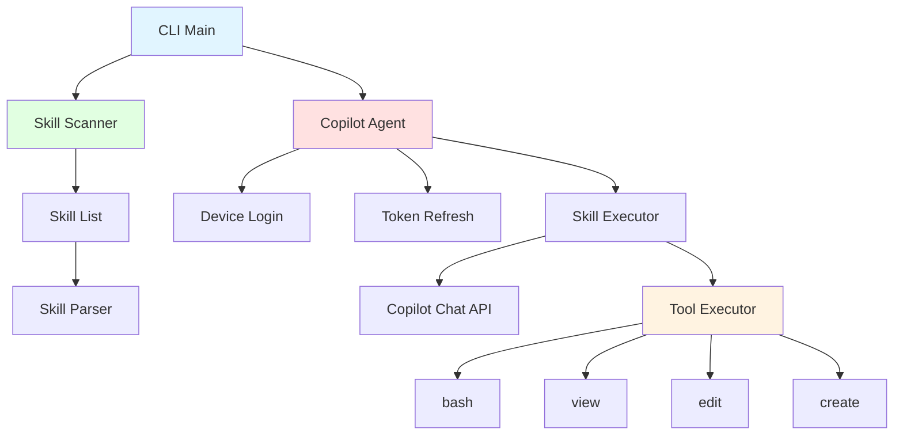

> [!NOTE]
> 此 README 由 [SKILL](https://github.com/pardnchiu/skill-readme-generate) 生成，英文版請參閱 [這裡](./README.md)。

# go-agent-skills

[](https://pkg.go.dev/github.com/pardnchiu/go-agent-skills)
[](https://goreportcard.com/report/github.com/pardnchiu/go-agent-skills)
[](LICENSE)
[](https://github.com/pardnchiu/go-agent-skills/releases)

> 一個輕量級的 Go CLI 工具，用於執行 skill 並整合 GitHub Copilot 認證機制

## 目錄

- [功能特點](#功能特點)
- [架構](#架構)
- [安裝](#安裝)
- [使用方法](#使用方法)
- [CLI 參考](#cli-參考)
- [API 參考](#api-參考)
- [授權](#授權)
- [Author](#author)
- [Stars](#stars)

## 功能特點

- **GitHub Copilot 認證**：支援裝置碼登入流程與 token 自動刷新機制
- **Skill 掃描**：自動掃描 `.claude/skills` 目錄下的所有可用 skill
- **Skill 執行**：透過 Copilot Chat API 執行 skill 並處理工具呼叫循環
- **工具執行器**：內建完整的工具執行系統
- **Token 管理**：自動處理 token 過期與更新，確保認證狀態持續有效
- **命令列介面**：提供 `list` 與 `run` 指令來管理與執行 skill

### 開發路線圖

**認證機制：**
- [x] 支援 GitHub Copilot 認證
- [ ] 支援 Claude API key 認證
- [ ] 支援 Claude 裝置認證
- [ ] 支援 OpenAI API key 認證
- [ ] 支援 OpenAI 裝置認證

**Skill 管理：**
- [x] 支援從多個目錄列出/執行 skill（`.claude/skills`、`.skills`、`.opencode/skills`、`.openai/skills`、`.codex/skills`、`/mnt/skills/*`）

**工具實作：**
- [x] 實作 `read_file(path)` - 讀取檔案內容
- [ ] 實作 `list_files(path, recursive)` - 列出目錄內容
- [ ] 實作 `glob_files(pattern)` - 依模式尋找檔案
- [ ] 實作 `search_content(pattern, file_pattern)` - 在檔案中搜尋文字
- [ ] 實作 `write_file(path, content)` - 寫入/建立檔案
- [ ] 實作 `run_command(command)` - 執行 shell 指令 (git, go, npm, python3, 等等)

## 架構



## 安裝

### 前置需求

- Go 1.20 或更高版本
- GitHub Copilot 訂閱（用於認證）

### 從原始碼安裝

```bash
git clone https://github.com/pardnchiu/go-agent-skills.git
cd go-agent-skills
go build -o agent-skills cmd/cli/main.go
```

### 使用 go install

```bash
go install github.com/pardnchiu/go-agent-skills/cmd/cli@latest
```

## 使用方法

### 首次認證

第一次執行時，會自動觸發 GitHub Copilot 裝置碼登入流程：

```bash
./agent-skills
```

系統會顯示：
1. 使用者代碼（User Code）
2. 驗證網址（Verification URI）

在瀏覽器中開啟驗證網址並輸入使用者代碼完成認證。

### 列出所有可用的 Skill

```bash
./agent-skills list
```

輸出範例：

```
Found 3 skill(s):

• readme-generate
  從原始碼分析自動生成雙語 README
  Path: /Users/user/.claude/skills/readme-generate

• version-generate
  從最新的 git tag 到 HEAD 生成結構化變更日誌並推薦新版本
  Path: /Users/user/.claude/skills/version-generate

• commit-generate
  從 git diff 生成單句提交訊息
  Path: /Users/user/.claude/skills/commit-generate
```

### 執行 Skill

```bash
./agent-skills run <skill_name> <input>
```

範例：

```bash
./agent-skills run commit-generate "generate commit message from current changes"
```

## CLI 參考

| 指令 | 語法 | 描述 |
|---------|--------|-------------|
| `list` | `./agent-skills list` | 列出所有已安裝的 skill |
| `run` | `./agent-skills run <skill> <input>` | 執行指定的 skill |

### 環境變數

| 變數 | 預設值 | 描述 |
|----------|---------|-------------|
| `HOME` | - | 用於定位 token 儲存路徑 `~/.copilot/` |

## API 參考

### Client Package (`internal/client`)

#### `NewCopilot() (*CopilotAgent, error)`

建立新的 Copilot 客戶端實例，會自動載入或建立 token。

**回傳值：**
- `*CopilotAgent`：Copilot 客戶端實例
- `error`：錯誤訊息（若有）

#### `(*CopilotAgent) Execute(ctx context.Context, skill *skill.Skill, userInput string, output io.Writer) error`

執行指定的 skill。

**參數：**
- `ctx`：Context 實例
- `skill`：要執行的 Skill 實例
- `userInput`：使用者輸入的指令或提示
- `output`：輸出寫入器（通常為 `os.Stdout`）

**回傳值：**
- `error`：執行過程中的錯誤（若有）

#### `CopilotLogin(ctx context.Context, tokenPath string) (*CopilotToken, error)`

執行裝置碼登入流程。

**參數：**
- `ctx`：Context 實例
- `tokenPath`：token 儲存路徑

**回傳值：**
- `*CopilotToken`：認證 token
- `error`：錯誤訊息（若有）

### Skill Package (`internal/skill`)

#### `NewScanner() *Scanner`

建立新的 Skill 掃描器實例。

**回傳值：**
- `*Scanner`：掃描器實例

#### `(*Scanner) Scan() (*SkillList, error)`

掃描所有可用的 skill。

**回傳值：**
- `*SkillList`：包含所有掃描到的 skill
- `error`：錯誤訊息（若有）

#### `(*SkillList) List() []string`

取得所有 skill 名稱列表。

**回傳值：**
- `[]string`：skill 名稱陣列

### Tools Package (`internal/tools`)

#### `NewExecutor(workPath string) (*Executor, error)`

建立新的工具執行器。

**參數：**
- `workPath`：工作目錄路徑

**回傳值：**
- `*Executor`：工具執行器實例
- `error`：錯誤訊息（若有）

#### `(*Executor) Execute(name string, args json.RawMessage) (string, error)`

執行指定的工具。

**參數：**
- `name`：工具名稱（如 `bash`、`view`、`edit`、`create`）
- `args`：JSON 格式的工具參數

**回傳值：**
- `string`：工具執行結果
- `error`：錯誤訊息（若有）

### 資料結構

#### `CopilotToken`

```go
type CopilotToken struct {
    AccessToken string    `json:"access_token"`
    TokenType   string    `json:"token_type"`
    Scope       string    `json:"scope"`
    ExpiresAt   time.Time `json:"expires_at"`
}
```

#### `Skill`

```go
type Skill struct {
    Name        string // skill 名稱
    Description string // skill 描述
    AbsPath     string // 絕對路徑
    Path        string // 相對路徑
    Content     string // 完整檔案內容
    Body        string // skill 主體內容
    Hash        string // 內容雜湊值
}
```

#### `SkillList`

```go
type SkillList struct {
    ByName map[string]*Skill // 以名稱索引的 skill
    ByPath map[string]*Skill // 以路徑索引的 skill
    Paths  []string          // 掃描的路徑列表
}
```

#### `Tool`

```go
type Tool struct {
    Type     string       `json:"type"`
    Function ToolFunction `json:"function"`
}

type ToolFunction struct {
    Name        string          `json:"name"`
    Description string          `json:"description"`
    Parameters  json.RawMessage `json:"parameters"`
}
```

## 授權

本專案採用 [MIT LICENSE](LICENSE)。

## Author


<h4 style="padding-top: 0">邱敬幃 Pardn Chiu</h4>

<a href="mailto:dev@pardn.io" target="_blank">

</a> <a href="https://linkedin.com/in/pardnchiu" target="_blank">

</a>

## Stars

[](https://www.star-history.com/#pardnchiu/go-agent-skills&Date)

***

©️ 2026 [邱敬幃 Pardn Chiu](https://linkedin.com/in/pardnchiu)
