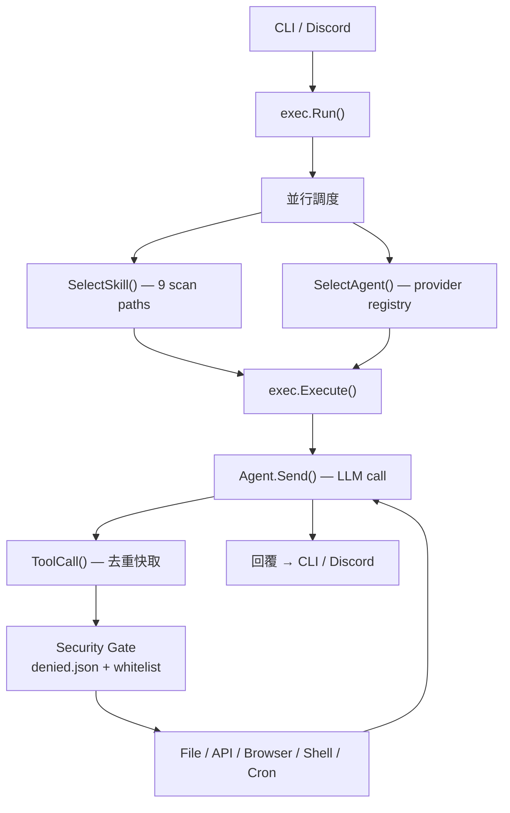

> [!NOTE]
> 此 README 由 [SKILL](https://github.com/pardnchiu/skill-readme-generate) 生成，英文版請參閱 [這裡](../README.md)。<br>
> 測試由 [SKILL](https://github.com/pardnchiu/skill-coverage-generate) 生成。


# Agenvoy

[](https://pkg.go.dev/github.com/pardnchiu/agenvoy)
[](https://goreportcard.com/report/github.com/pardnchiu/agenvoy)
[](https://app.codecov.io/github/pardnchiu/agenvoy/tree/master)
[](LICENSE)
[](https://github.com/pardnchiu/agenvoy/releases)

> Go 語言 Agentic AI 平台，具備技能路由、多 Provider 智能調度、Discord Bot 整合與安全優先的共用 Agent 設計

## 目錄

- [功能特點](#功能特點)
- [架構](#架構)
- [檔案結構](#檔案結構)
- [授權](#授權)
- [Author](#author)
- [Stars](#stars)

## 功能特點

> `go install github.com/pardnchiu/agenvoy/cmd/cli@latest` · [完整文件](./doc.zh.md)

### 並行 Skill 與 Agent 調度

Selector Bot 在單一規劃階段同時從 9 個標準路徑掃描 Markdown Skill 定義，並從 Provider 登錄檔中選出最合適的 AI 後端，兩者並行執行而非依序查找。配對完成後，執行引擎以最多 128 次迭代的工具呼叫迴圈完成任務，並在達到上限時自動觸發摘要。

### 宣告式 Extension 架構

19 個以上的內建工具受到內嵌封鎖清單與 Shell 指令白名單的沙箱保護 — SSH 金鑰、`.env` 檔案（`.example` 變體除外）及憑證目錄均被拒絕存取；`rm` 指令被攔截並導向 `.Trash`。在內建工具之外，兩層 Extension 機制無需修改程式碼即可擴充能力：API Extension 是放置於 `~/.config/agenvoy/apis/` 的 JSON 檔，啟動時自動載入並成為 AI 可呼叫的工具，支援 URL 路徑參數、請求範本與 Bearer/API Key 認證；13 個以上的公開 API Extension 已內嵌（地理編碼、金融、資料來源）；Skill Extension 是 Markdown 格式的任務指令集，啟動時由 SyncSkills 自動從 GitHub 下載官方 Skill 至本地，並從 9 個標準路徑掃描所有可用 Skill。

### OS Keychain 憑證管理

Provider API 金鑰儲存於系統原生的 OS Keychain（macOS / Linux / Windows），而非 `.env` 檔案，防止憑證意外洩漏。GitHub Copilot 採用 OAuth Device Code Flow 並支援自動刷新令牌。六個 Provider（Copilot、OpenAI、Claude、Gemini、NVIDIA、Compat）共用統一的互動式 `agenvoy add` 設定流程，可從內嵌模型登錄檔互動選擇模型。

## 架構



## 檔案結構

```
agenvoy/
├── cmd/
│   ├── cli/                # CLI：add / remove / list / run
│   └── server/             # Discord Bot 進入點
├── extensions/
│   ├── apis/               # 內嵌 API Extension（13+ JSON）
│   └── skills/             # 內嵌 Skill Extension（Markdown）
├── internal/
│   ├── agents/
│   │   ├── exec/           # 核心執行引擎與 Session 迴圈
│   │   ├── provider/       # 6 個 AI Provider 後端 + 模型登錄檔
│   │   └── types/          # Agent 介面 + Message 類型
│   ├── cron/               # 一次性任務排程 Daemon
│   ├── discord/            # Discord Slash Command + 檔案附件
│   ├── skill/              # Markdown Skill 掃描器與解析器
│   ├── tools/              # 19+ 內建工具 + Cron + 自訂 API 適配器
│   └── keychain/           # OS Keychain 憑證儲存
├── go.mod
└── LICENSE
```

## 授權

本專案採用 [Apache-2.0 LICENSE](../LICENSE)。

## Author


<h4 style="padding-top: 0">邱敬幃 Pardn Chiu</h4>

<a href="mailto:dev@pardn.io" target="_blank">

</a> <a href="https://linkedin.com/in/pardnchiu" target="_blank">

</a>

## Stars

[](https://www.star-history.com/#pardnchiu/agenvoy&Date)

***

©️ 2026 [邱敬幃 Pardn Chiu](https://linkedin.com/in/pardnchiu)
