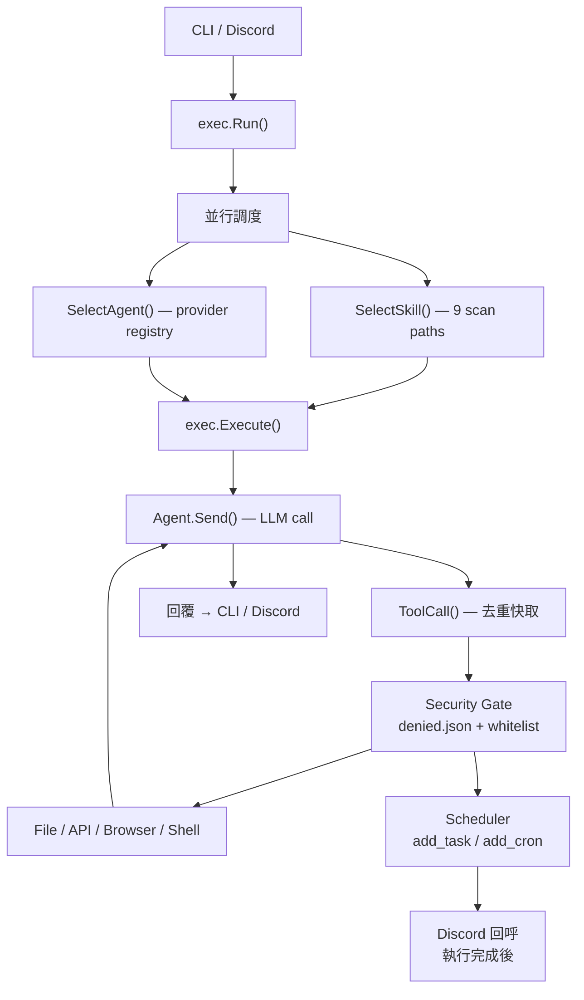

> [!NOTE]
> 此 README 由 [SKILL](https://github.com/pardnchiu/skill-readme-generate) 生成，英文版請參閱 [這裡](../README.md)。<br>
> 測試由 [SKILL](https://github.com/pardnchiu/skill-coverage-generate) 生成。


# Agenvoy

[](https://pkg.go.dev/github.com/pardnchiu/agenvoy)
[](https://goreportcard.com/report/github.com/pardnchiu/agenvoy)
[](https://app.codecov.io/github/pardnchiu/agenvoy/tree/master)
[](LICENSE)
[](https://github.com/pardnchiu/agenvoy/releases)

> Go 語言 Agentic AI 平台，具備多 Provider 智能路由、Skill 驅動執行、持久化任務排程、JSON 驅動工具擴充與安全優先的憑證管理

## 目錄

- [功能特點](#功能特點)
- [架構](#架構)
- [檔案結構](#檔案結構)
- [版本歷史](#版本歷史)
- [授權](#授權)
- [Author](#author)
- [Stars](#stars)

## 功能特點

> `go install github.com/pardnchiu/agenvoy/cmd/cli@latest` · [完整文件](./doc.zh.md)

### 多 Provider LLM 智能路由

Agenvoy 將七個 AI 後端 — GitHub Copilot、Claude、OpenAI、Gemini、Nvidia NIM，以及任意 OpenAI 相容端點（Compat/Ollama）— 統一於單一 `Agent` 介面之後。專屬 Planner LLM 針對每個請求自動選出最適合的 Provider，無需手動切換模型。具名 `compat[{name}]` 實例支援多個本地模型端點並存，各自擁有獨立的 URL 與憑證設定。

### Skill 驅動的 Agentic 執行

Skill 是帶有 YAML Frontmatter 的 Markdown 定義檔（`SKILL.md`），描述任務的 System Prompt 與工具允許清單。執行時 Selector LLM 從 9 個標準掃描路徑中挑選最符合的 Skill，隨後驅動最多 128 次迭代的工具呼叫迴圈直至任務完成。達到迭代上限時自動觸發摘要而非回傳錯誤。官方 Skill Extension 由 SyncSkills 在啟動時從 GitHub 自動同步至本地。

### 25 個以上跨六大類別的內建工具

執行器內建完整工具鏈：檔案操作（`read_file`、`write_file`、`patch_edit`、`glob_files`、`search_content`）、網路存取（`search_web`、`fetch_page`、`download_page`、`fetch_google_rss`）、排程（`add_task`、`add_cron`、`write_script`）、錯誤記憶（`remember_error`、`search_errors`、`get_tool_error`）、數學計算器，以及任意 HTTP 請求。所有 `rm` 操作均導向 `.Trash`，所有寫入使用先寫 tmp 再 rename 的原子性操作防止部分寫入損毀。

### JSON 驅動的 API Extension 架構

外部 REST API 以 JSON 定義檔放置於 `extensions/apis/` 並由 API 適配器在執行時載入，無需修改 Go 程式碼即可擴充工具。已內嵌 13 個公開 API：Yahoo Finance、CoinGecko、Wikipedia、World Bank、USGS 地震、Nominatim、Open-Meteo、HackerNews、REST Countries、TheMealDB、IP-API 與匯率。自訂端點遵循相同 Schema，工具數量可無限擴充且不需重新編譯。

### Discord Bot 模式與任務排程

`cmd/server` 啟動支援直接訊息與 Slash Command 的持久化 Discord Bot，並維護每個頻道的獨立 Session 狀態。整合排程器支援一次性任務（`+5m` 相對延遲或絕對時間戳）與週期性 Cron 任務（標準 5 欄位表達式，由 `go-scheduler` 在登錄時驗證）。每個任務綁定 Discord 頻道 ID，腳本執行完成後由 Planner Agent 處理 stdout 並自動回傳至對應頻道。`schedule-task` Skill 將自然語言排程意圖自動路由至排程器。

### 跨 Session 持久化記憶

每輪對話結尾，Agent 輸出結構化 JSON 摘要，以欄位層級的去重策略深度合併至先前的 Session 摘要後儲存於 `~/.config/agenvoy/`。後續 Session 注入此摘要以及最近 N 輪對話，使 Agent 無需重播完整歷史即可引用過往決策、限制條件與結論。工具執行錯誤以 SHA-256 金鑰持久化，Agent 可在重試前查詢歷史根因。

### OS Keychain 憑證管理

API 金鑰儲存於系統原生 Keychain（macOS Keychain、Linux Secret Service）而非 `.env` 檔案，防止憑證意外洩漏。GitHub Copilot 採用 OAuth Device Code Flow 並自動刷新令牌。互動式 `agenvoy add` / `agenvoy remove` 指令管理全部六個 Provider 的憑證，並提供內嵌模型登錄檔供引導選擇。多層路徑封鎖清單阻止存取 SSH 金鑰、Shell 設定檔、雲端憑證（`.aws`、`.gcloud`、`.docker`）、`.env` 檔案與私鑰格式。

## 架構



## 檔案結構

```
agenvoy/
├── cmd/
│   ├── cli/                # CLI：add / remove / list / run
│   └── server/             # Discord Bot 進入點
├── configs/                # 內嵌 Prompt 與 Provider JSON 登錄檔
├── extensions/
│   ├── apis/               # 內嵌 API Extension（13+ JSON）
│   └── skills/             # 內嵌 Skill Extension（Markdown）
├── internal/
│   ├── agents/
│   │   ├── exec/           # 核心執行引擎與 Session 迴圈
│   │   ├── provider/       # 6 個 AI Provider 後端 + 模型登錄檔
│   │   └── types/          # Agent 介面 + Message 類型
│   ├── discord/            # Discord Slash Command + 檔案附件
│   ├── filesystem/         # 集中路徑常數與 Session 管理
│   ├── scheduler/          # 持久化一次性與週期性任務排程器
│   ├── skill/              # Markdown Skill 掃描器與解析器
│   ├── tools/              # 25+ 內建工具 + API Extension 適配器
│   └── keychain/           # OS Keychain 憑證儲存
├── go.mod
└── LICENSE
```

## 版本歷史

- **v0.12.0** — 完整排程子系統（Cron + 一次性任務含 Discord 回呼）；集中 `filesystem` + `configs` 套件；以 `go-scheduler` 取代自製 Cron 解析器；`schedule-task` Skill
- **v0.11.2** — 修正錯誤記憶雙向關鍵字比對；修正 Claude 多段 System Prompt 合併；System Prompt 新增工具呼叫前禁止輸出文字規則
- **v0.11.1** — 工具執行錯誤追蹤（hash 型 `tool_errors/`）；原子性寫入（`utils.WriteFile`）；Gemini 多部分訊息修正；8 個新公開 API Extension；`get_tool_error` 工具
- **v0.11.0** — 宣告式 Extension 架構 — 內建 Go API 工具遷移為 JSON Extension；`SyncSkills` 從 GitHub 同步；授權改為 **Apache-2.0**
- **v0.10.2** — 修正 OpenAI 推理模型（`gpt-5`、`gpt-4.1`）不支援 `temperature` 的問題；`no_temperature` 模型旗標；`planner` 指令；`makefile`
- **v0.10.1** — Provider 模型登錄檔（內嵌 JSON）；互動式模型選擇 UI；全 Provider 統一 `temperature=0.2`
- **v0.10.0** — Discord Bot 模式（完整 Slash Command 支援）；`download_page` 瀏覽器工具；多層敏感路徑安全限制（`denied.json`）；HTML 轉 Markdown 轉換器
- **v0.9.0** — 檔案注入（`--file`）、圖片輸入（`--image`）；`remember_error` / `search_errors` 工具；網路搜尋 SHA-256 快取（1 小時 TTL）；`remove` 指令；公開 API（`GetSession`、`SelectAgent`、`SelectSkill`）
- **v0.8.0** — 正式更名為 **Agenvoy**（AGPL-3.0）；OS Keychain 整合；具名 `compat[{name}]` 實例；GitHub Actions CI + 單元測試
- **v0.7.2** — CLI 入口拆分為職責模組；`mergeSummary` 深度合併策略；API 範例設定（exchange-rate、ip-api）
- **v0.7.1** — 修正全 Provider Race Condition（改為 struct 實例欄位）；修正 `runCommand` / `moveToTrash` 中的 Context 傳遞鏈；以 `json.Unmarshal` 取代 `strconv.Unquote` 處理 Unicode
- **v0.7.0** — LLM 驅動自動 Agent 路由；OpenAI 相容（`compat`）Provider / Ollama 支援；`search_history` 工具；Session 檔案鎖；單體 `exec.go` 拆分為子套件
- **v0.6.0** — 概要式持久化記憶；Session 歷史（`history.json`）；Tool Action 記錄；集中式 `utils.ConfigDir()`
- **v0.5.0** — 新增 `fetch_page`（無頭 Chrome + stealth JS）、`search_web`（Brave + DDG 並行）、`calculate`；全工具鏈 Context 傳遞
- **v0.4.0** — 內建 API 工具（天氣、股票、新聞、HTTP）；JSON 驅動 API 適配器；`patch_edit` 工具；Skill 自動匹配引擎；`io.Writer` → Event Channel 輸出模型
- **v0.3.0** — 多 Agent 後端支援：OpenAI、Claude、Gemini、Nvidia；統一 `Agent` 介面；Goroutine 並行 Skill 掃描器
- **v0.2.0** — 新增完整檔案系統工具鏈（`list_files`、`glob_files`、`write_file`、`search_content`、`run_command`）、指令白名單、互動式確認、`--allow` 旗標
- **v0.1.0** — 初始版本 — GitHub Copilot CLI，含 Skill 執行迴圈與自動 Token 刷新

## 授權

本專案採用 [Apache-2.0 LICENSE](../LICENSE)。

## Author


<h4 style="padding-top: 0">邱敬幃 Pardn Chiu</h4>

<a href="mailto:dev@pardn.io" target="_blank">

</a> <a href="https://linkedin.com/in/pardnchiu" target="_blank">

</a>

## Stars

[](https://www.star-history.com/#pardnchiu/agenvoy&Date)

***

©️ 2026 [邱敬幃 Pardn Chiu](https://linkedin.com/in/pardnchiu)
